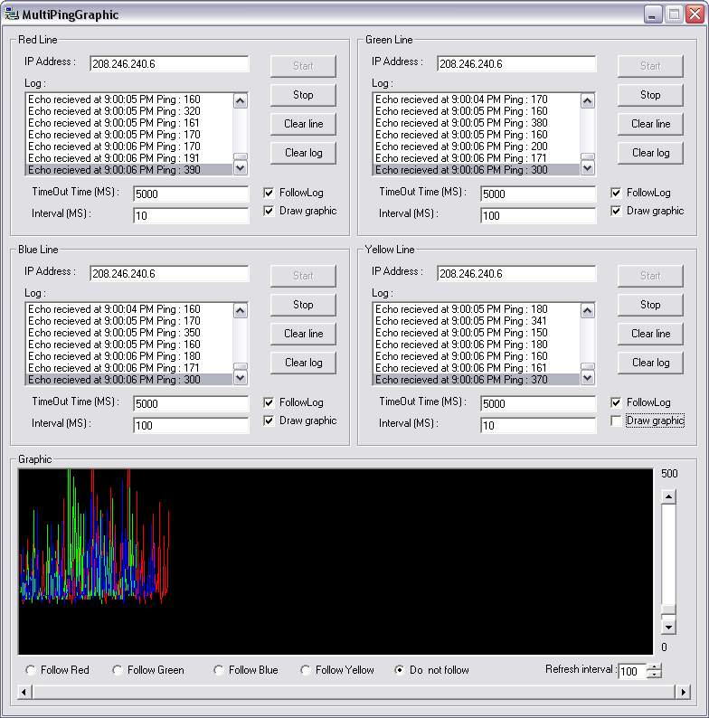



## PingGraphic V2

### Description

i already made this before but this code is more understandeble, and demonstartes how to ping some one using winsock olso this version can ping more IP addresses at a time with difrent color's have, fun egbert :o)
 
### More Info
 

             |
---                |---
**Submitted On**   |2002-02-21 15:34:08
**By**             |[egbert](https://github.com/Planet-Source-Code/PSCIndex/blob/master/ByAuthor/egbert.md)
**Level**          |Intermediate
**User Rating**    |4.9 (39 globes from 8 users)
**Compatibility**  |VB 6\.0
**Category**       |[Complete Applications](https://github.com/Planet-Source-Code/PSCIndex/blob/master/ByCategory/complete-applications__1-27.md)
**World**          |[Visual Basic](https://github.com/Planet-Source-Code/PSCIndex/blob/master/ByWorld/visual-basic.md)
**Archive File**   |[PingGraphi566472212002\.zip](https://github.com/Planet-Source-Code/egbert-pinggraphic-v2__1-31980/archive/master.zip)

